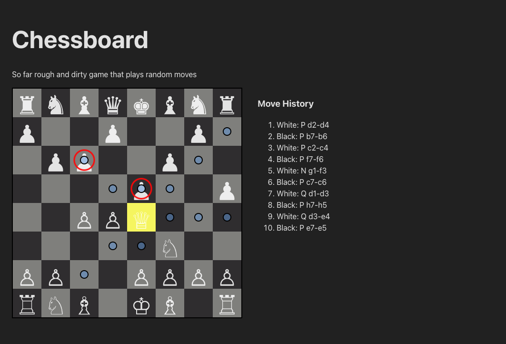

# quick & dirty react chess page

quick and dirty for the express purpose of playing against models

## Screenshot

## Features

you can kinda play. This is about an hour of work and the 'model' just palys random white moves

## TO DO

- implement model loading
- implement castling and en passant
- implement checks

## Getting Started

this is a vite react project so clone -> npm install -> run dev and you're away

## License

Use as needed